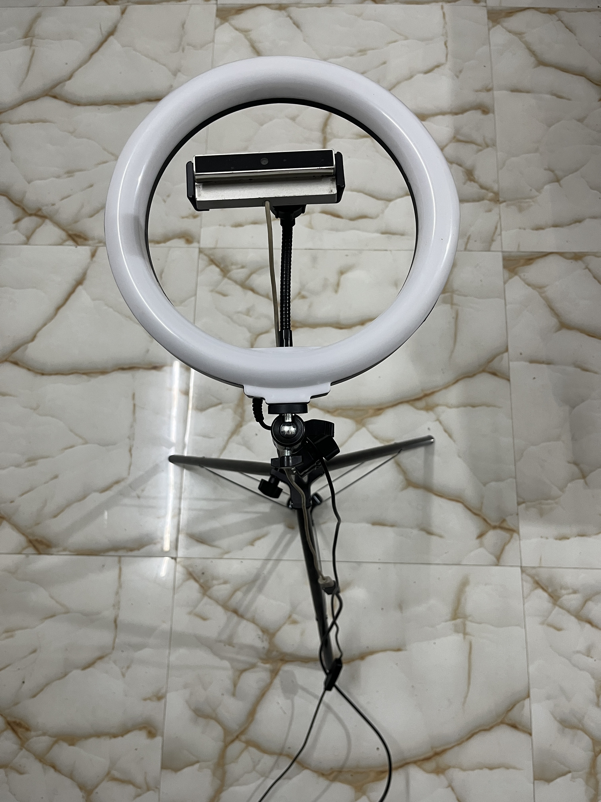
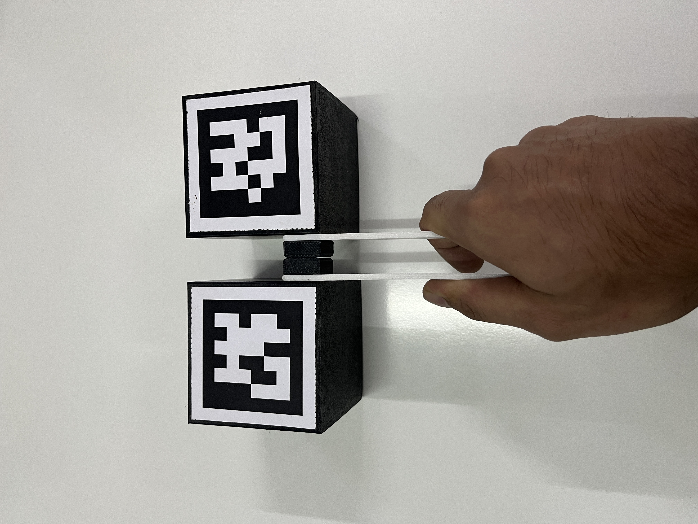

# __Teleop Tongs for [Giraffe](https://github.com/carpit680/giraffe) robotic manipulator__


This repository provides code for dexterous teleoperation of [Giraffe](https://github.com/carpit680/giraffe), a low-cost 5DoF robotic manipulator.

Teleop Tongs support performing efficient multijoint movement with Giraffe built on top of [Dex Teleop](https://github.com/hello-robot/stretch_dex_teleop) (for the [Stretch 3](https://hello-robot.com/stretch-3-product) mobile manipulator by [Hello Robot](https://hello-robot.com/)) and customized to work with any 5-7 DoF manipulators.

The human operator uses modified kitchen tongs or 3D printed tongs with attached ArUco markers to control the pose of the end effector. A webcam looking up from a stand placed on the ground observes the tongs to estimate the tongs' position, orientation, and grip width. A ring light around the webcam ensures that the ArUco markers can be detected during fast motions by reducing motion blur.

The system could be adapted to use other interfaces that can provide a five to seven degrees of freedom (5-7 DOF) target pose and grip width/angle at a high rate (e.g., >= 15 Hz). The position of this target pose controls the end of the robotic manipulator via inverse kinematics (IK). The grip width commands the robot's gripper.

## Motivation

HuggingFace has done some amazing work with the help of the community in developing [lerobot](https://github.com/huggingface/lerobot) with its plug-and-play Imitation Learning pipeline. At the time of development one can setup a Koch V1.1, Standard Open ARM 100 or Aloha bimanual setup with leader and follower arms to teleoperate and collect episodes to train the model with.

I initially wanted to repplicate their setup and build on top of that but later figured, why not make this pipeline even more accessible and so I developed my own version of low-cost robotic manipulator and this teleop_tongs to create a data collection setup at most half the cost of other available setups.

## Setting Up Teleop dex

You should start by cloning this repository. All of the commands below should be run from the command line in the root directory of the repository on your robot's computer. 

### Build Your Interface

You can 3D print the components required for the Teleop Tongs setup along with the feducial markers by following the __[Teleop Tongs Assembly Guide](./teleop_tongs_assembly_guide.md)__.

You will need a camera, a ring light, and optionally a stand as shown in the following photo.

<div style="text-align: center;">
    
</div>

For a single robot, you will need Teleop Tongs like those shown in the following two photos.

<div style="text-align: center;">
    
    
</div>

### Run the Installation Scripts

Clone this github repository.

```bash
git clone -b ros2 https://github.com/carpit680/teleop_tongs.git
```

Then run the following installation script found in the repository's root directory.

```bash
./install_dex_teleop.sh
```
> :warning: **Warning**  
> The device ID and Vendor ID used in the `99-teleop-tongs-camera.rules`, required below is specific to the camera I used. 
> If you are using a different camera, you will need to change the device ID and Vendor ID in this file.

The installation script sets up a udev rule for a Mi USB Webcam HD, so that the camera can be reset each time you run dexterous teleoperation. This is a workaround to avoid low frame rates and errors in the camera settings.

Next, the installation script installs v4l2 utilities, if necessary.

You also need to install some python dependencies:

```bash
pip install -r requirements.txt
pip install -e . # To install as a python package in editable mode
```

### Generate Specialized URDFs

To run Teleop Tongs, you need to generate specialized URDF files. Teleop Tongs uses forward kinematic (FK) and inverse kinematic (IK) models of the robot. These models use specialized URDFs generated from the calibrated URDF on your robot. Use the `giraffe.urdf` file provided as an example of how the URDF should look like.

### Set Up the Camera, Ring Light and Stand

As shown in the photo above, the camera stand should be placed on the ground, and the camera should be pointed straight up. The stand should be at its minimum height.

The camera should be plugged into your computer using a USB extension cable. The ring light should not be plugged carelessly as it requires too much power - it can either be plugged into a powered USB port, or externally.

When using the camera, the bottom of the camera should be pointed away from you. With respect to the robot, the bottom of the camera points in the direction of arm extended forward from its base, and the lens of the camera looks up.

### Calibrate the Webcam

After setting up your camera, you need to calibrate it.

> :warning: **Warning**
> The calibration scripts contain parameters for camera name and resolution. Customize these parameters if necessary.

> :memo: **Note:**
> If you face permission issues with the camera or any other usb device, execute the following commands:
> ```bash
> sudo usermod -a -G dialout $USER
> newgrp dialout
> ```

First, generate a calibration board using the following command:

```bash
cd teleop_tongs
python3 webcam_calibration_create_board.py
```

This should result in the following PNG file.

```bash
webcam_aruco_calibration_board.png
```

Print this image out without scaling it. The resulting printout should match the dimensions specified in the PNG file.

Mount the resulting printout on a flat surface that you can move around the camera to capture calibration images __with the ring light turned on__.

Use the following command and your calibration pattern to collect calibration images for your Mi USB Webcam. The entire calibration board should be visible and not too far away, or else the calibration images can lead to errors.

```bash
python3 webcam_calibration_collect_images.py
```

The images will be stored in the following directory.

```bash
./webcam_calibration_images/<camera name>/<camera resolution>
```

Once you've collected the calibration images, run the following command to process the images.

```bash
python3 webcam_calibration_process_images.py
```

Processing the images will generate a YAML calibration file similar to the following file.

```bash
./webcam_calibration_images/<camera name>/<camera resolution>/camera_calibration_results_20231211211703.yaml

```

### Test the Camera

To make sure that your camera detects the ArUco markers on your tongs, __turn on the ring light__ and run the following code __from the root directory__.

```bash
python3 teleop_example.py
```

You should see images from the camera with green boxes drawn around detected ArUco markers.

## Running Teleop Tongs with lerobot

After you have everything set up, you can import this python package and run Teleop Tongs on your own robot or with [modified lerobot repository](https://github.com/carpit680/lerobot).

* Clone lerobot repository and checkout the branch `user/carpit680/2024_1_5_teleop_tongs`:
    ```bash
    git clone https://github.com/carpit680/lerobot.git -b user/carpit680/2024_1_5_teleop_tongs
    ```
* Follow the instructions from lerobot repository to setup your robot.
* Update camera_calibration_results.yaml file with your camera calibration results obtained above.
* Update giraffe.urdf file with your robot's URDF.
* Here we treat giraffe as a variation fo so100 robot and will use the configs of so100.
* Teleoperate your robot to test Teleop Tongs setup.
    ```bash
    python lerobot/scripts/control_robot.py teleoperate \
    --robot-path lerobot/configs/robot/so100.yaml \
    --cam-calib-path lerobot/configs/camera_calibration_results.yaml \
    --urdf-path lerobot/configs/<robot-urdf-file> \
    --robot-overrides \
        '~cameras'
    ```

## ROS2 Integration

If you want to try it out with ROS2, you can also run Teleop Tongs with simulation or real robot with Giraffe.

Follow the instructions from [Giraffe](https://github.com/carpit680/giraffe) repository to setup your robot.

* Clone this ros2 branch of Teleop Tongs repository if you want to use ros2_control or raw_ros2 if you want to use topics.
    ```bash
    git clone https://github.com/carpit680/teleop_tongs.git -b ros2 # for ros2_control based communication to giraffe_driver with simulation or robot hardware.
    # OR
    git clone https://github.com/carpit680/teleop_tongs.git -b raw_ros2 # for topics based direct communication to giraffe_driver with only robot hardware.
    ```
* Run Giraffe simulation or real robot depending on branch you chose above.
* Run `python3 dex_teleop.py` to start Teleop Tongs.


## Running Teleop Tongs with Giraffe Hardware(no lerobot or ROS2, just for fun)

After you've gotten everything setup, you can try out Teleop Tongs inside simulation with Giraffe. Make sure to start with slow motions, to test your system, gain experience, and warm up.

* Follow the instructions from Giraffe repository to setup your robot hardware.
* Use the `raw` branch of Teleop Tongs repository if you want to write to robot hardware directly.
    ```bash
    git clone https://github.com/carpit680/teleop_tongs.git -b raw
    ```
* Run Teleop Tongs with `python3 dex_teleop.py`.

## Acknowledgment

**Original acknowledgment**
“*Blaine Matulevich has been extremely helpful throughout the development of Teleop Tongs, including testing, providing feedback, discussing the system, and contributing ideas. The entire Hello Robot team provided essential support throughout, including helping with early versions of Stretch 3, which the entire company worked on intensely.*”

The detailed instructions from Charlie Kemp and the original code from [Dex Teleop for Stretch](https://github.com/hello-robot/stretch_dex_teleop) by Hello Robot Inc. were great starting points for developing Teleop Tongs for general-purpose low-cost manipulators.
