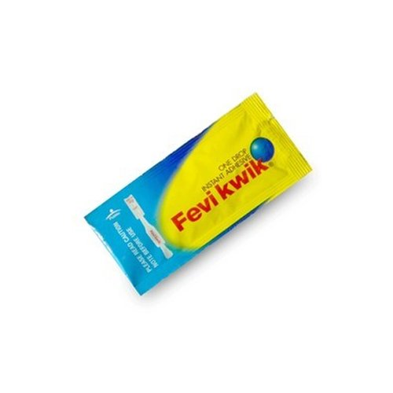

# Teleop Tongs Assembly Guide

*Version 0.1*   
*January 8, 2025*  
[*Arpit Chauhan*](https://carpit680.github.io)

[Parts List](#parts-list)

[Camera, Ring Light, and Stand](#camera,-ring-light,-and-stand)

[Tong Build Instructions](#tong-build-instructions)

[Right-Hand Tongs](#your-teleop-tongs-should-look-somewhat-like-this)

[Photos of Right-Hand Tongs](#photos-of-right-hand-tongs)

[Acknowledgment](#acknowledgment)

These instructions are based on instructions by Hello Robot Inc. and Charlie Kemp for developing and exploring bimanual manipulation at home. Here I am describing the instructions for only right-hand tongs for Giraffe or any other 5-7 DoF manipulator.

This first version of these instructions is minimal. We hope to improve them in the future. 

# Parts List

[Logitech C930e 1080P HD Video Webcam on Amazon](https://www.amazon.com/dp/B00CRJWW2G)  

    

[Sensyne 10” Desk Ring Light with Stand on Amazon](https://www.amazon.com/dp/B0B5Q41S75)  

    

[Loctite Super Glue Gel Control from Amazon](https://www.amazon.com/dp/B0006HUJCQ)  

    

**USB extension cables**  
I used USB extension cables for the camera and for the ring light for easier placement and try not plugging the ring light into your laptop. It might damage your USB port.

# Camera, Ring Light, and Stand

You should assemble the camera, ring light, and an optional stand to look like this.

    

# Tong Build Instructions

To build Teleop Tongs, you will print the tongs and superglue two cubic containers to them. After supergluing the cubic containers, you will attach unique ArUco markers on four sides of each cube.

## Your Teleop Tongs should look somewhat like this

    
    

When supergluing a cube onto a tong, the cube should be flush with one edge of the tongs, and the cube’s edge should rest against the edge of the thicker end of the tong.

Once you’ve attached the cube, you need to attach four ArUco markers to each cube.

You can use the following PDF file to print out the markers for the right-hand tongs. If you’d like to edit the file, you can use the Inkscape version. 

[Right-hand tongs PDF file](https://drive.google.com/file/d/1ViEcIBFxIBgyJmMSbwUu2KRaImCchBa-/view?usp=sharing)

    
    

When printing the files, you need to **be careful to print them with their defined dimensions**. However you create them, **you should measure the resulting markers to make sure that they have the correct dimensions and update them accordingly in the “dex\_teleop\_parameters.py” file**. The main ArUco pattern should be a 56 mm x 56 mm square. The outer edge of the white region surrounding the marker should be approximately 70 mm x 70 mm to fit on the sides of the cubes. 

For example, I used the following printer settings on a chromium-based browser.

Scale (%): Actual Size  
Quality: 1200 dpi  

    

## Photos of Right-Hand Tongs

You can use these photos to better see how the right-hand tongs should be built.

    
    

    
    

# Acknowledgment

**Original acknowledgement**
“*Blaine Matulevich has been extremely helpful throughout the development of Dex Teleop, including testing, providing feedback, discussing the system, and contributing ideas. The entire Hello Robot team provided essential support throughout, including helping me use early versions of Stretch 3, which the entire company worked on intensely.*”

The detailed instructions from Charlie Kemp and the original code from [Dex Teleop for Stretch](https://github.com/hello-robot/stretch_dex_teleop) by Hello Robot Inc. were great starting points for developing Teleop Tongs for general-purpose low-cost manipulators.
